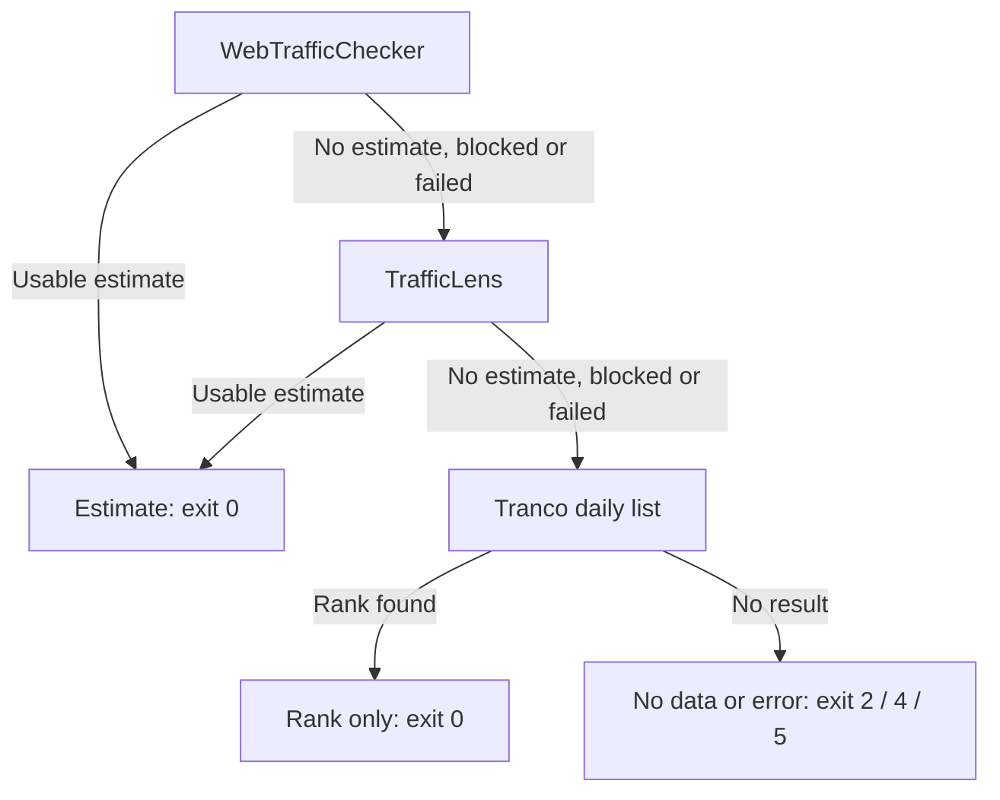

<p align="center">
  
</p>

<h1 align="center">ihav-web-visit-counter</h1>

<p align="center">Website traffic estimates, with dates and sources, inside Claude Code and Codex.</p>

<p align="center">
  <a href="https://github.com/hiendang7613/ihav-web-visit-counter/actions/workflows/ci.yml"></a>
  <a href="https://github.com/hiendang7613/ihav-web-visit-counter/releases/tag/v0.1.2"></a>
  <a href="LICENSE"></a>
  
  
</p>

**A traffic estimate is not private analytics.** The plugin tries WebTrafficChecker, then TrafficLens for domains with a returned visit value, then a Tranco rank. TrafficLens coverage is partial and its sample was stale; every number keeps its source and date. No source has an independently measured error interval.

[Install](#install-in-30-seconds) · [Demo](#demo) · [Scripts](#use-from-scripts) · [Accuracy](#accuracy-honestly) · [Sources and terms](#data-sources-and-terms)

## Install in 30 seconds

Requires Python 3.9 or later. The plugin core uses only the Python standard library. It does not need a paid account, API key, or browser.

1. Add the shared ihav catalog and install the plugin in your host.

   **Claude Code**

   ```text
   Install ihav-web-visit-counter by running: claude plugin marketplace add hiendang7613/ihav && claude plugin install ihav-web-visit-counter@ihav
   ```

   **Codex**

   ```text
   Install ihav-web-visit-counter by running: codex plugin marketplace add hiendang7613/ihav && codex plugin add ihav-web-visit-counter@ihav
   ```

2. Restart Claude Code or Codex so it loads the installed skill.
3. Ask: **“How many monthly visits does example.com get?”**

In Claude Code, you can also type `/ihav-web-visit-counter example.com`. If another command owns the short name, use `/ihav-web-visit-counter:ihav-web-visit-counter`. In Codex, mention `$ihav-web-visit-counter:ihav-web-visit-counter` or ask in plain language.

<details>
<summary>Install directly from this repository</summary>

Use this alternative if you want only this plugin's catalog.

Claude Code:

```bash
claude plugin marketplace add hiendang7613/ihav-web-visit-counter
claude plugin install ihav-web-visit-counter@ihav-web-visit-counter
```

Codex:

```bash
codex plugin marketplace add hiendang7613/ihav-web-visit-counter
codex plugin add ihav-web-visit-counter@ihav-web-visit-counter
```

</details>

## What you get

| Field | What appears | Limit |
|---|---|---|
| Monthly visits | A numeric estimate or the provider's rounded display value | No owner analytics or measured error interval |
| Analysis date | Analysis or scrape date beside the value | Not a guaranteed reporting month |
| Countries | Returned country shares | Available only when the provider supplies them |
| History | Dated snapshots actually returned | No invented 12-month series |
| Source link | The provider behind the result | One provider answers; numbers are never merged |
| JSON contract v2 | Structured result and provider outcomes | Rank-only results keep visits `null` |

## Demo

**Synthetic example.** These figures are invented to show the output format. They are not a provider result and do not describe `example.com`.

```text
example.com
  ~2,430,000 estimated monthly visits · analyzed 2026-09-11
  Error range: not independently measured
  History snapshots 2026-08-13 → 2026-09-11  ▁█
  Top countries: US 41.0% · IN 9.0% · GB 6.0%
  Source: WebTrafficChecker · https://webtrafficchecker.com/traffic/example.com
  Note: This is a provider-modelled estimate, not the website owner's analytics.
```

`assets/hero.svg` and `assets/demo.svg` use the same clearly labelled synthetic example.



## Usage

Ask your agent:

- “How many monthly visits does `example.com` get?”
- “Show the traffic history for `example.com`.”
- “Which countries appear in the estimate for `example.com`?”

## Use from scripts

From a terminal, run the bundled command from the plugin skill directory:

```bash
python3 scripts/visits.py example.com
python3 scripts/visits.py https://www.example.com/pricing --json
```

On Windows, use `py -3` in place of `python3`.

This **synthetic JSON excerpt** shows the fields a consumer can use. The CLI also returns the provenance and optional fields described below.

```json
{
  "contract_version": 2,
  "domain": "example.com",
  "kind": "estimate",
  "monthly_visits": 2430000,
  "monthly_visits_text": "2,430,000",
  "period": null,
  "analyzed_at": "2026-09-11T00:00:00Z",
  "cached": false,
  "providers": [
    {"name": "webtrafficchecker", "outcome": "ok", "http_status": 200, "detail": null},
    {"name": "trafficlens", "outcome": "skipped", "http_status": null, "detail": null},
    {"name": "tranco", "outcome": "skipped", "http_status": null, "detail": null}
  ]
}
```

The JSON output uses contract version `2`. Success and error objects include a top-level `providers` array. Each entry has `name`, `outcome`, `http_status`, and `detail`. Provider names are `webtrafficchecker`, `trafficlens`, or `tranco`; outcomes are `ok`, `no_data`, `blocked`, `failed`, `skipped`, or `cached`. Entries follow provider order. After a provider returns a result, later providers appear as `skipped`.

`http_status` reports the provider API response only. A provider can return a challenge page with HTTP `200`; that outcome is `blocked`. A network failure has a null status. On a cache hit, the array names the provider whose value was cached, uses outcome `cached`, and keeps the original `fetched_at`. It does not report a prior provider block as current. Use these fields to detect blocks; `detail` and `error.notes` are for people and can change wording.

Expected exit codes:

| Code | Meaning |
|---:|---|
| `0` | Estimate or rank result returned |
| `2` | The primary returned no usable result and no later provider returned data; later failures are listed in `error.notes` |
| `4` | The primary was blocked by access refusal, rate limit, or challenge and no fallback returned data; do not rerun this domain |
| `5` | The primary had a network or provider failure and no fallback returned data, or an internal error occurred |
| `64` | Invalid input or command arguments |

Estimate results are cached for 24 hours; rank-only results are not cached. A cached TrafficLens estimate can delay rechecking a recovered WebTrafficChecker for up to 24 hours. This accepted trade-off reduces repeat requests to TrafficLens. Runtime files are written under `./.ihav_space/ihav-web-visit-counter/` in the current working directory. Set `IHAV_CACHE_DIR` or pass `--cache-dir` to use another location. Add `.ihav_space/` to your project's `.gitignore` if you do not want runtime data tracked.

## What the result means

| Kind | What you receive | What it does not mean |
|---|---|---|
| `estimate` | `monthly_visits` is an integer for WebTrafficChecker and `null` for TrafficLens. `monthly_visits_text` is the display string: comma-grouped for WebTrafficChecker or the provider's original rounded string for TrafficLens. The source, date and returned country shares/history are also included. | It is not website-owner analytics. WebTrafficChecker's `analyzedAt` is an analysis timestamp; TrafficLens's `scrapedAt` is a scrape timestamp, not a reporting month. A stale TrafficLens value stays marked stale. Neither source publishes a measured error interval in the observed responses. |
| `rank_only` | A rank from Tranco's downloaded daily top-1M list | A rank is not visits. Both `monthly_visits` and `monthly_visits_text` are `null`. |

TrafficLens's rank-only response is skipped; it does not replace the final Tranco rank result or become visits. The plugin never converts rank to visits, averages or merges provider estimates, or creates a 12-month series when a provider has only a few history points. Each lookup returns one provider's result. In JSON, `monthly_visits` is always an integer or `null`; use `monthly_visits_text` for an estimate's display value when `monthly_visits` is `null`.

## How it works



A fresh estimate cache returns before this chain. Invalid input exits `64`. Each source is tried once; a block stops requests to that source.

1. Normalize the URL or domain while preserving subdomains other than a leading `www.`.
2. Return the local 24-hour result cache when it is fresh.
3. Ask WebTrafficChecker once. A usable `monthlyVisits` value becomes `kind: estimate` with the raw `analyzed_at` timestamp.
4. If WebTrafficChecker has no usable estimate, is blocked, or fails, ask TrafficLens once. A valid `monthlyVisits` value becomes a separate `kind: estimate`; `monthly_visits` stays `null` and its formatted value is preserved in `monthly_visits_text`. Its `period` stays `null`, and its scrape date and stale state are shown. A TrafficLens ranking-only response is skipped.
5. If neither source returns a visit estimate, try the Tranco fallback once. Its result is `kind: rank_only`; it never becomes a visit count. The output says why the fallback was used.
6. Stop a source on HTTP 401, 403, 429, or challenge content. The plugin does not retry that source or use browser routes or block workarounds. One provider answers each lookup; results are never averaged or merged.

## Accuracy, honestly

WebTrafficChecker describes the number as a modelled estimate based on ranking and public signals. The endpoint response observed for v0 includes `monthlyVisits`, `analyzedAt`, a provider rank, geography shares, and some `historicalRanks` points. TrafficLens sometimes returns a rounded visits string and scrape timestamp, but the retained probe was stale and did not include a reporting month. Neither source has a measured error interval, and our probe did not establish a comparable owner-published visits anchor. We therefore show no percentage error band or calibrated rank-to-visits estimate.

Very small or unranked sites may return no visit number by design. When WebTrafficChecker marks a domain unranked (`isRanked: false`, rank zero or missing, or category `Unranked Website`), the plugin rejects its placeholder estimate and default country split. It continues to TrafficLens and Tranco; if neither supplies a usable visit count, the result does not include a visit number.

WebTrafficChecker's `analyzed_at` timestamp is shown as “analyzed YYYY-MM-DD”. TrafficLens's `scraped_at` timestamp is shown as “scraped YYYY-MM-DD”; when its payload says `source=stale`, the output also says “stale”. Neither timestamp proves which start and end dates the provider used to compute `monthlyVisits`. TrafficLens may return a rounded string rather than an exact integer. History contains only points actually returned by the provider; it is not guaranteed to cover 12 months. Country shares are provider estimates, not site analytics, and JSON shares are rounded to four decimal places. WebTrafficChecker returns one fixed country split (US 45.2%, IN 10.3%, BR 6.5%, GB 6.5%, DE 5.2%) for many low-traffic domains; the plugin treats that split as a placeholder, omits it and adds a note.

Tranco is a popularity ranking. If neither visits provider returns a usable estimate and the domain appears in its list, the plugin shows the rank and leaves visits unknown. If WebTrafficChecker returns no usable estimate and no later provider returns data, the CLI exits `2`; any later provider failures appear in the error's `notes` field. Exits `4` and `5` are reserved for a blocked or failed primary when no fallback returns a result.

## Data sources and terms

| Source | Role | Use in this plugin | Notes |
|---|---|---|---|
| [WebTrafficChecker](https://webtrafficchecker.com/) | Primary | Public JSON endpoint; modelled `monthlyVisits`, `analyzedAt`, rank, country shares and any history returned | Terms allow reasonable, low-volume automated use but prohibit using its API to build a substantially similar or competing service. This plugin proceeds without asking the operator, as decided by the maintainers. The clause may apply to this plugin; limits are not documented, and access may be suspended. We cache estimate results for 24 hours, send one request per lookup, attribute the source and stop if access is refused. |
| [TrafficLens](https://trafficlens.io/) | Middle fallback | Keyless public Worker endpoint; may return a formatted `monthlyVisits` string, `scrapedAt`, a stale marker and country shares. Rank-only responses are skipped. | Partial coverage: a retained probe returned a stale GitHub value but only a Tranco rank for Python. TrafficLens terms restrict extraction at scale and reproduction/commercial use; its terms and privacy page name SimilarWeb among upstreams, so upstream terms may also apply. Public access does not establish permission to reproduce this data in a plugin. We retain the raw rounded string, mark stale data, cache estimates for 24 hours, make one request and stop on refusal. |
| [Tranco](https://tranco-list.eu/) | Final fallback | Download the daily top-1M list and perform a local rank lookup | Rank only, not visits. The composite list includes upstream data with different licenses. The plugin downloads it at runtime and does not bundle the list; users should check the source license for their intended use. The per-domain API is not used. |

Public availability is not the same as owner analytics or an unrestricted data license. This plugin is independent and is not affiliated with any listed source. If a source blocks or refuses access, the plugin reports it and stops that source. It does not use stealth browsers, proxies, fake user agents, CAPTCHA solving, or alternate routes to bypass a block. One provider supplies each returned estimate; the plugin never averages results.

See [how it works](docs/how-it-works.md), [accuracy notes](docs/accuracy.md), and [terms and risks](docs/terms-and-risks.md).

## Privacy and local files

The requested domain is sent to WebTrafficChecker. If it returns no usable visit estimate, the domain may also be sent once to TrafficLens. If neither supplies visits, the plugin downloads Tranco's public rank list and searches it locally. It does not send prompts, cookies, API keys, or account credentials. A 24-hour estimate cache and downloaded list live in `.ihav_space/ihav-web-visit-counter/` under the current working directory; remove that folder to clear them. Rank-only results are not cached.

## FAQ

**How accurate are the visit counts?** They are third-party estimates with no independently measured error interval. Keep the source and analysis or scrape date with the number; stale data stays labelled stale.

**Why does a small website get no number?** The plugin rejects WebTrafficChecker's unranked placeholder estimates. If the other sources have no usable visits, it returns a rank or no data.

**Which sources does it use?** WebTrafficChecker first, TrafficLens for a visit-count fallback, then Tranco for rank only. Each lookup returns one provider's result.

**Can I use the data for anything?** Provider terms still apply. WebTrafficChecker has a competing-service clause, and TrafficLens restricts extraction and reuse. Read [terms and risks](docs/terms-and-risks.md) before publishing or using results at scale.

**Does it work on Windows?** The core supports Python 3.9 or later and writes UTF-8 output for agent pipes. Use `py -3` for terminal examples and restart your coding agent after installation.

## Contributing

See [CONTRIBUTING.md](CONTRIBUTING.md). Please include a saved response fixture for provider changes; tests must not contact live sites.

Questions and ideas: [Discussions](https://github.com/hiendang7613/ihav-web-visit-counter/discussions).

**Related ihav plugins:** Find the rest of the family in the [shared ihav catalog](https://github.com/hiendang7613/ihav).

## License

MIT. See [LICENSE](LICENSE).
